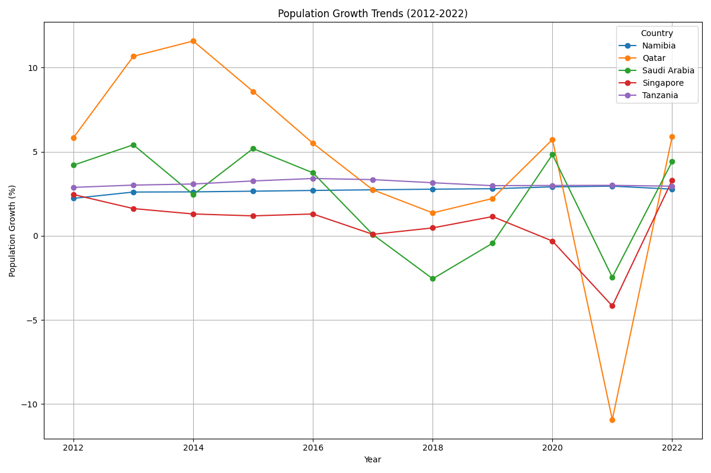
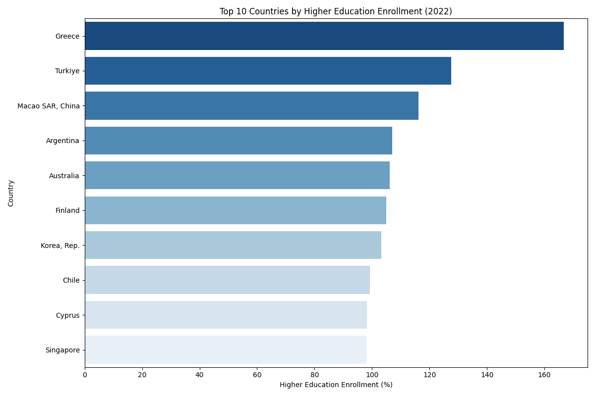
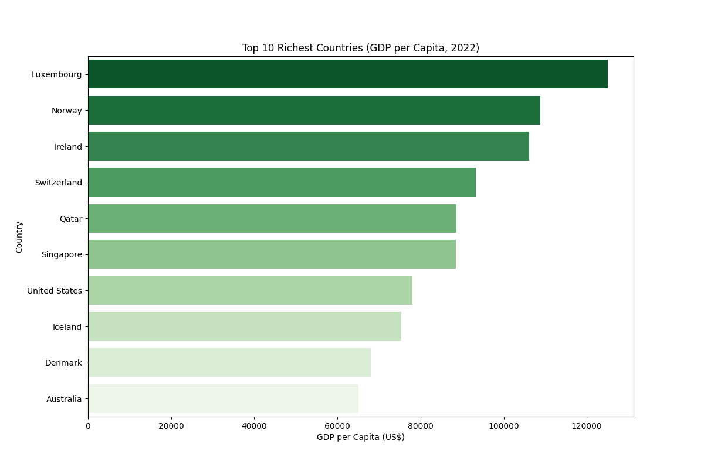
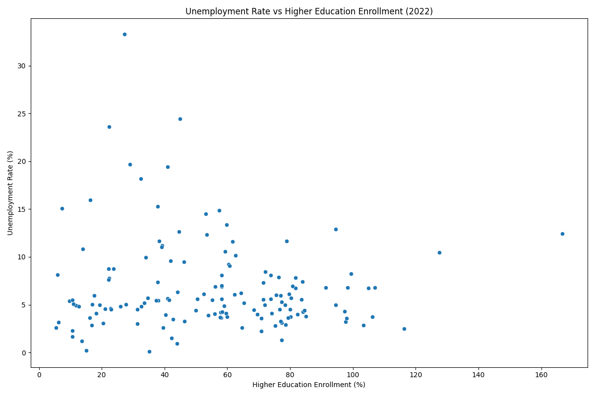

# 🌍 World Bank Data Analysis Project

This project utilizes real-world data from the World Bank to analyze and visualize global economic and social indicators across countries.

---

## 📂 Project Structure

```
world-bank-project/
├── data/                                  # World Bank datasets (CSV)
├── notebooks/                             # Jupyter Notebook analysis
├── images/                                # Visualization graphs
├── requirements.txt                       # Python libraries and dependencies
└── README.md                              # Project overview (this file)
```

---

## ⚙️ Installation & Running the Project

Follow these clear and straightforward instructions to set up and run the project locally:

### Step 1: Clone Repository

```bash
git clone https://github.com/akilajuan/world-bank-project.git
cd world-bank-project
```

### Step 2: Set Up Environment

```bash
python -m venv env
source env/bin/activate    # On Windows: .\env\Scripts\activate
pip install -r requirements.txt
```

### Step 3: Run Analysis

```bash
jupyter notebook
```

Open `notebooks/WorldBank_EDA.ipynb` to view analysis and visualizations clearly.

---

## 📊 Visualizations and Insights

### 🔹 Population Growth Trends (2012-2022)


**Insight:** 
- Shows countries with rapidly increasing populations, highlighting economic growth potential or resource challenges.

---

### 🔹 Top 10 Countries by Higher Education Enrollment (2022)


**Insight:**
- Countries investing significantly in higher education enrollment potentially have stronger human capital and lower unemployment rates.

---

### 🔹 Top 10 Richest Countries by GDP per Capita (2022)


**Insight:**
- European nations like Luxembourg and Norway dominate per capita GDP, showcasing concentrated economic prosperity clearly.

---

### 🔹 Unemployment Rate vs Higher Education Enrollment (2022)


**Insight:**
- Visual exploration reveals how higher education levels correlate with unemployment rates, showing potential economic benefits of educational investment.

---

## 🙋‍♂️ Author

- **Akila Juan**
- [GitHub](https://github.com/akilajuan)
- [LinkedIn](https://www.linkedin.com/in/akila-juan-a9622a203/)

